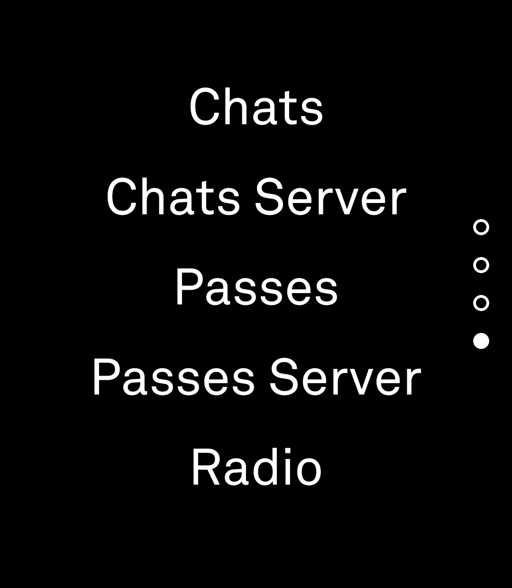
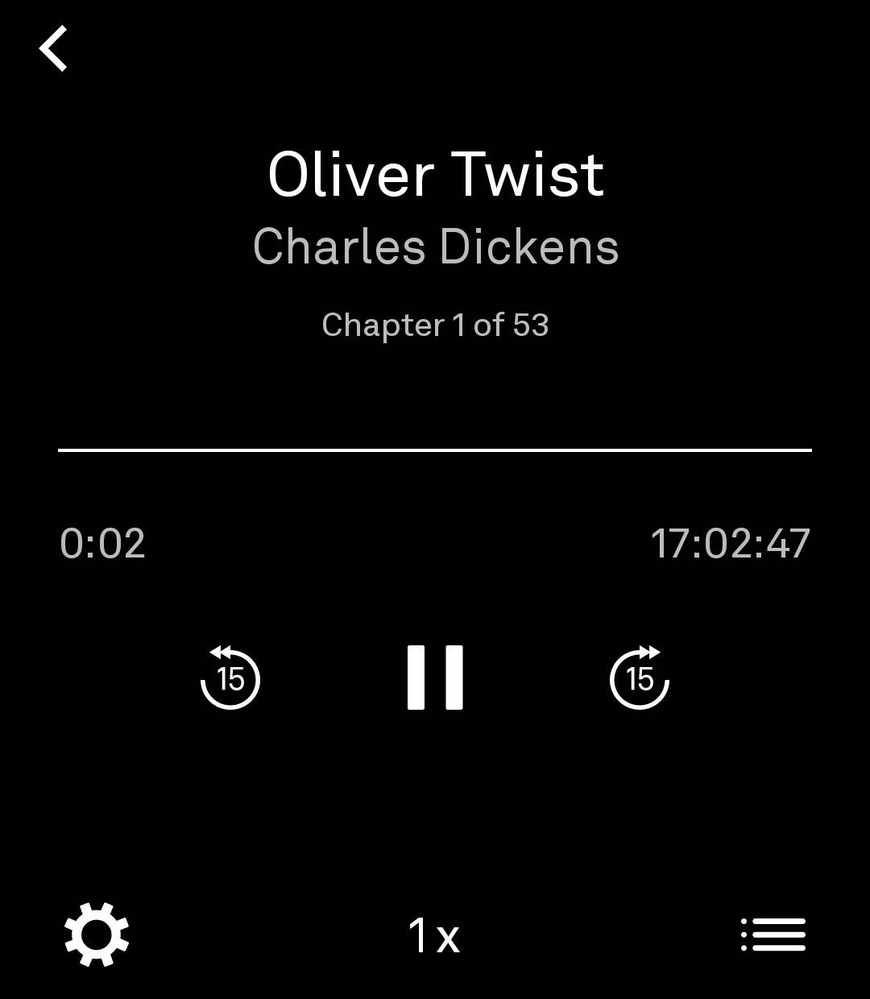
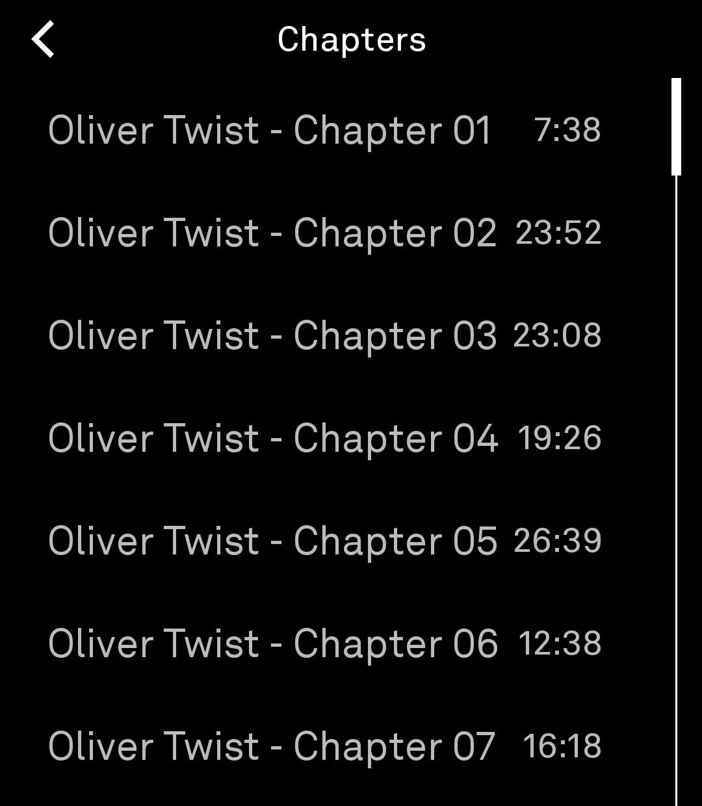
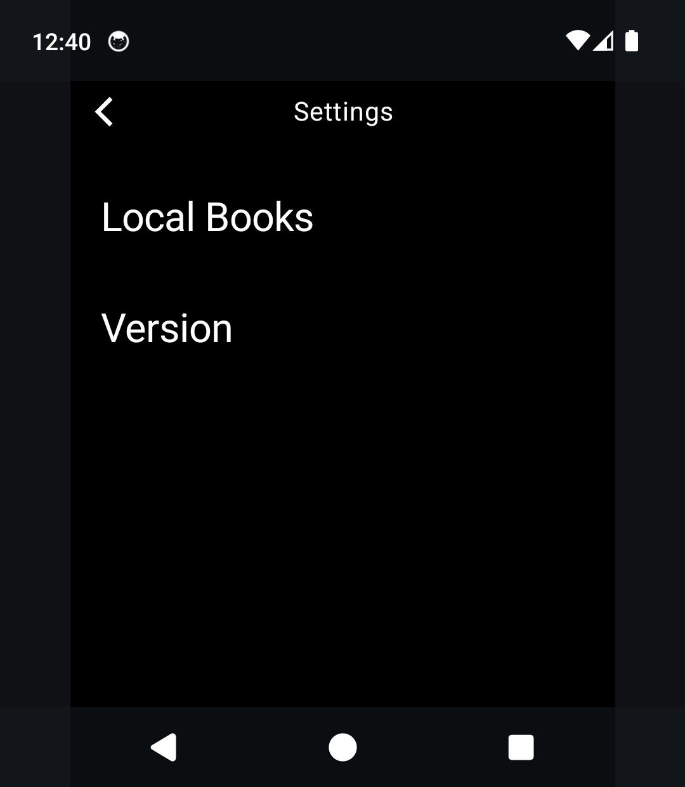
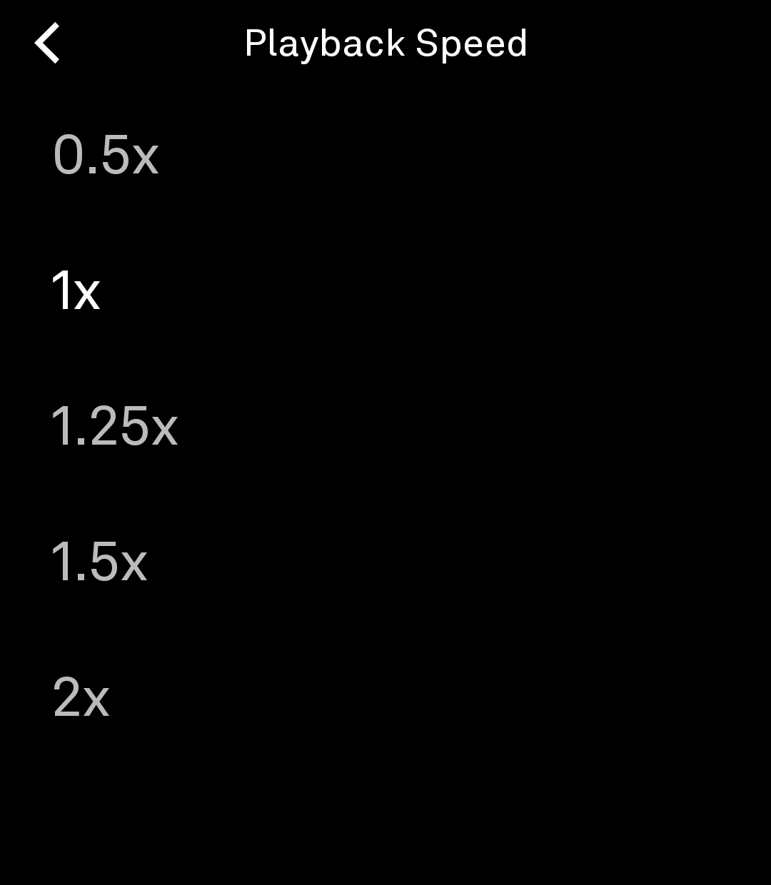

# Audiobooks

*A minimalist audiobook player for the Light Phone III.*

Audiobooks is an audiobook player built specifically for the Light Phone III. It plays audiobooks stored on your device in a calm, text-first interface inspired by the philosophy of Light OS.

Instead of treating audiobooks as another streaming platform, Audiobooks treats them as books. Your library lives on your device, and the player stays out of the way so you can focus on listening.

There are no recommendations, storefronts, advertisements, social features, or cover art—just your books.

Built with the Light ethos: **stripped back, calm, and intentionally small**. Books load from the device — a single shared folder, no accounts, no cloud. Audiobooks is a **real LightOS tool**: a thin interface built on the Light SDK design system, with a companion app hosting the on-device library, scanning, and playback — the same tool + companion architecture Light's own music and podcast tools use, so background listening survives the tool closing.

**Heritage:** Audiobooks began as a fork of [Bard](https://github.com/sjkornelsen/bard) by sjkornelsen, rebuilt around local-only playback.

Audiobooks is currently in **beta**. It is suitable for daily use; features and behavior may still evolve before a stable release.

> **Current Status:** Beta
>
> **Current Version:** 0.5.5 (versionCode 16)

> **About the name:** the app is called *Audiobooks* — a plain, descriptive
> name in the Light Phone tool-naming style. Application IDs:
> `com.lightphone.audiobooks` (tool) and `com.lightphone.audiobooks.server`
> (companion).

---

# Screenshots

The library, player, chapter list, settings, and speed picker on a Light Phone III (light-on-black):

<p align="center">
  
  
  
  
  
</p>

---

# Features

## Local Audiobooks

Audiobooks plays audiobooks stored on your device, without a cloud account or subscription.

### Supported Formats

- MP3
- M4B

### Features

- Single-file audiobooks
- Multi-file audiobooks organized as folders, played continuously in embedded track order (disc/track tags, fallback: natural filename order)
- Chapter list with per-chapter seek — folder books use their files, single-file books use their embedded chapters (MP3 chapter tags, M4B bookmarks)
- Chapter-scoped time and progress in the player; whole-book percent in the library
- Playback speed (0.5x–2x), with an optional Auto-Play "next chapter" toggle
- Persistent listening progress across the entire book
- Resume playback
- Recent-first library ordering
- Background playback with a media notification and lockscreen/system media controls

Audiobooks scans the shared `Audiobooks` folder at any depth. Individual .mp3 and .m4b files directly inside `Audiobooks/` are treated as standalone books. Every folder inside `Audiobooks/` is treated as a single audiobook, with all supported audio files inside it played continuously in alphabetical order. Audiobooks never copies books into app-private storage.

---

# Getting Started

## Local Audiobooks

1. Connect your Light Phone III to your computer.
2. Create an `Audiobooks` folder in shared device storage if it does not already exist.
3. Either:
  - copy a single .mp3 or .m4b directly into the Audiobooks folder, or
  - create one folder per audiobook and place its audio files inside.

Files are played in alphabetical order, so numbering them (01, 02, 03, …) is recommended.

4. In Audiobooks, open the app — the library lists every book found in the folder (tap the settings icon in the library's bottom bar, then "Scan Library Now", to rescan).

Android may request permission to read your audio library. Audiobooks does **not** request broad "All Files" storage access.

---

# Current Limitations

Audiobooks is currently designed for the Light Phone III and Android 13 or newer.

Current limitations include:

- Multi-file local audiobooks play in embedded track order (disc/track tags, fallback: natural filename order); chapter titles come from embedded metadata (fallback: file name).
- Hardware volume buttons are not wired to playback volume yet (on the roadmap — see `WORKLOG.md`).

---

# Architecture

Audiobooks is a native Android application written in Kotlin using Jetpack Compose.

Its architecture is intentionally simple, with separate components responsible for local audiobook discovery, playback, progress persistence, and the interface.

The UI is built on the Light SDK's design system (`sdk:ui`) and playback runs on the SDK's `LightAudioPlayer` (ExoPlayer). Audiobooks is a standalone Gradle project that consumes the SDK as an included build — see `settings.gradle.kts`. It is a **real LightOS tool**: the `:app` module is built with the SDK's tool plugin (launched from the LightOS toolbox), and the `:server` module is a plain companion app that hosts the SDK service, the local library scan, and the playback foreground service — the privileged work the tool plugin forbids in the tool itself. The tool is a thin UI over the companion, so background playback survives the tool closing.

---

# What the companion adds beyond the current LightOS SDK

The tool talks to the companion over the SDK's binder using **media methods that are additive to the SDK** — they were added to `sdk:shared`'s `LightServiceMethod` and are implemented by the companion. The production LightOS server (`com.lightos`) does **not** implement these yet; the companion is the reference implementation, and the plan is for Light to ship the same surface so tools can target `com.lightos` directly. The companion provides:

- **The media RPC surface** — `GetBooks`, `ScanLibrary`, `OpenBook`/`PlayBook`, `PausePlayback`, `SeekTo`, `SeekToPart`, `SetPlaybackSpeed`, `GetPlaybackState`, `GetAutoPlayNext`/`SetAutoPlayNext`, and `DeleteBook`.
- **Library scanning** — a recursive scan of `/sdcard/Audiobooks/` (any depth) into single-file and folder books, with titles and chapter names read from embedded metadata (album/title tags) rather than file names.
- **Continuous multi-part playback** — folder books play across all their files on a single global timeline, so seeking, progress, and chapter boundaries work book-wide rather than per file.
- **Chapter-aware playback** — per-chapter seek, "Chapter N of M" tracking, and an optional Auto-Play "next chapter" toggle that pauses at chapter boundaries when off. Single-file books read their own embedded chapters (MP3 CHAP frames, M4B bookmarks) for the same experience folder books get per file.
- **Background playback** — a foreground `Service` plus a media session and media-button receiver for lockscreen/system controls. The tool plugin forbids foreground services in the tool, so the companion owns playback — background listening survives the tool closing (the same model as LightOS's own music and podcast tools).
- **Persistent progress** — listening position, speed, and ordering survive restarts, stored per book.

---

# Development

## Requirements

- JDK 17 or 21 (the workspace provides both under `tools/`)
- Android SDK (API 36)
- A sibling checkout of the Light SDK at `../light-sdk` (consumed as an included build). The local checkout carries a few additive Audiobooks patches (media methods, the tool→companion activity launcher, token sync — documented in the workspace `AGENTS.md`); the patched tree is mirrored at **https://github.com/fenleon/light-sdk** (fork of `lightphone/light-sdk`, `origin` there), with `upstream` pointing at the original.

## Build

From the workspace root, through the memory-guarded wrapper:

```bash
source tools/env.sh
tools/build --dir audiobooks :app:assembleDebug :server:assembleDebug
```

or directly in this directory:

```bash
./gradlew :app:assembleDebug :server:assembleDebug
```

Release signing instructions are available in `RELEASE.md`.

---

# Privacy & Security

Audiobooks does not include analytics, advertising, telemetry, or user accounts.

Local audiobooks remain on your device.

While listening, Audiobooks runs a foreground service so playback continues when the screen is off or Audiobooks is in the background. The playback notification shows the current book title; your library stays on-device.

---

# Roadmap

Planned improvements include:

- In-app library management (remove books)
- Additional playback refinements
- Performance and stability improvements

---

# Contributing

Contributions, bug reports, feature requests, and suggestions are welcome.

If you encounter a bug, please include:

- Audiobooks version
- Light Phone III software version
- Steps to reproduce
- Expected behavior
- Actual behavior

Before opening an issue, please check whether the problem has already been reported.

---

# Frequently Asked Questions

### Does Audiobooks require an account?

No.

Audiobooks play entirely offline and do not require an account.

---

### Does Audiobooks collect analytics or usage data?

No.

Audiobooks does not include analytics, advertising, telemetry, or user tracking.

---

### Does Audiobooks support offline listening?

Yes.

Local audiobooks are always available offline.

---

# Important

Audiobooks is an independent, unofficial open-source project.

Audiobooks is not affiliated with, endorsed by, sponsored by, or approved by The Light Phone, Inc.

Light Phone and Light OS are trademarks of The Light Phone, Inc.

Other trademarks are the property of their respective owners and are used solely to identify compatibility with third-party products and services.

---

# License

Audiobooks is licensed under the MIT License.

See [LICENSE](LICENSE) for the complete license text.

Audiobooks incorporates selected resources derived from the Light SDK. Applicable notices are included in [THIRD_PARTY_NOTICES.md](THIRD_PARTY_NOTICES.md).

---

Built with ❤️ for the Light Phone community.
