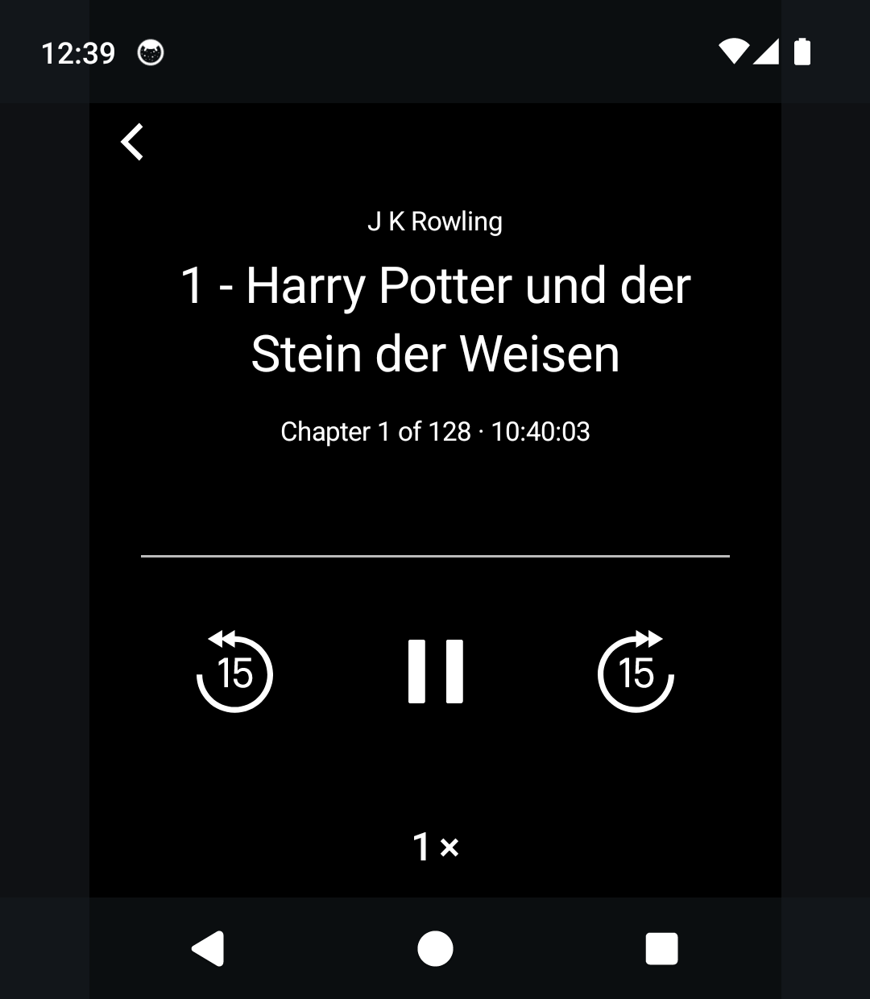
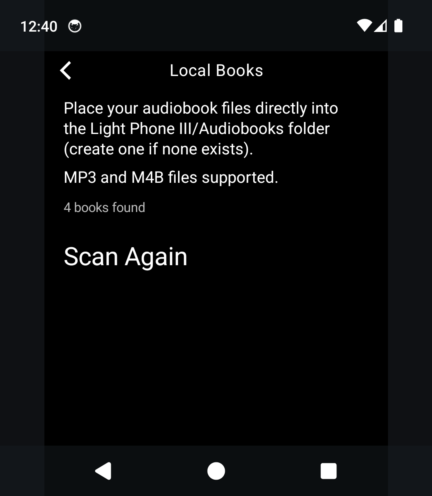

# Audiobooks

*A minimalist audiobook player for the Light Phone III.*

Audiobooks is an audiobook player built specifically for the Light Phone III. It plays audiobooks stored on your device in a calm, text-first interface inspired by the philosophy of Light OS.

Instead of treating audiobooks as another streaming platform, Audiobooks treats them as books. Your library lives on your device, and the player stays out of the way so you can focus on listening.

There are no recommendations, storefronts, advertisements, social features, or cover art—just your books.

Audiobooks is currently in **alpha**. While it is already suitable for daily use, features and behavior may continue to evolve before a stable release.

> **Current Status:** Alpha
>
> **Current Version:** 0.1.0 (versionCode 11)

> **About the name:** the app is called *Audiobooks* — a plain, descriptive
> name in the Light Phone tool-naming style. It was formerly known as *Bard*;
> the package and internal identifiers keep the historical heritage so the app
> identity and upgrade path never change.

---

# Screenshots

The library, player, and local-book settings on the LightOS emulator (light-on-black, like the device):

<p align="center">
  
  
  
</p>

<p align="center">
  
  
</p>

---

# Features

## Local Audiobooks

Audiobooks plays audiobooks stored on your device, without a cloud account or subscription.

### Supported Formats

- MP3
- M4B

### Features

- Single-file audiobooks
- Multi-file audiobooks organized as folders
- Continuous playback across multiple files
- Combined timeline and duration
- Persistent listening progress across the entire book
- Resume playback
- Recent-first library ordering
- Background playback with a media notification and lockscreen/system media controls

Audiobooks scans the shared `Audiobooks` folder at any depth. Individual .mp3 and .m4b files directly inside `Audiobooks/` are treated as standalone books. Every folder inside `Audiobooks/` is treated as a single audiobook, with all supported audio files inside it played continuously in alphabetical order. Audiobooks never copies books into app-private storage.

---

# Getting Started

## Local Audiobooks

1. Connect your Light Phone III to your computer.
2. Create an `Audiobooks` folder in shared device storage if it does not already exist.
3. Either:
  - copy a single .mp3 or .m4b directly into the Audiobooks folder, or
  - create one folder per audiobook and place its audio files inside.

Files are played in alphabetical order, so numbering them (01, 02, 03, …) is recommended.

4. In Audiobooks, open:

```
Settings → Local Books → Scan for Books
```

Android may request permission to read your audio library. Audiobooks does **not** request broad "All Files" storage access.

---

# Current Limitations

Audiobooks is currently designed for the Light Phone III and Android 13 or newer.

Current limitations include:

- Multi-file local audiobooks are played in filename order. Chapter metadata within multi-file books is not yet exposed in the interface.
- Embedded chapter navigation is not supported.
- Cover art is intentionally omitted throughout the interface.
- Ebook reading, cloud synchronization, metadata editing, and podcast-specific features are not currently supported.

---

# Architecture

Audiobooks is a native Android application written in Kotlin using Jetpack Compose.

Its architecture is intentionally simple, with separate components responsible for local audiobook discovery, playback, progress persistence, and the interface.

The UI is built on the Light SDK's design system (`sdk:ui`) and playback runs on the SDK's `LightAudioPlayer` (ExoPlayer). Audiobooks is a standalone Gradle project that consumes the SDK as an included build — see `settings.gradle.kts`. It is a plain Android app rather than a LightOS "tool" because it needs a playback foreground service and direct storage access, which the SDK's tool plugin forbids.

---

# Development

## Requirements

- JDK 17 or 21 (the workspace provides both under `tools/`)
- Android SDK (API 36)
- A sibling checkout of the Light SDK at `../light-sdk` (consumed as an included build)

## Build

From the workspace root, through the memory-guarded wrapper:

```bash
source tools/env.sh
tools/build --dir bard :app:assembleDebug
```

or directly in this directory:

```bash
./gradlew :app:assembleDebug
```

Release signing instructions are available in `RELEASE.md`.

---

# Privacy & Security

Audiobooks does not include analytics, advertising, telemetry, or user accounts.

Local audiobooks remain on your device.

While listening, Audiobooks runs a foreground service so playback continues when the screen is off or Audiobooks is in the background. The playback notification shows the current book title; your library stays on-device.

---

# Roadmap

Planned improvements include:

- Chapter navigation
- Additional playback refinements
- Performance and stability improvements

---

# Contributing

Contributions, bug reports, feature requests, and suggestions are welcome.

If you encounter a bug, please include:

- Audiobooks version
- Light Phone III software version
- Steps to reproduce
- Expected behavior
- Actual behavior

Before opening an issue, please check whether the problem has already been reported.

---

# Frequently Asked Questions

### Does Audiobooks require an account?

No.

Audiobooks play entirely offline and do not require an account.

---

### Does Audiobooks collect analytics or usage data?

No.

Audiobooks does not include analytics, advertising, telemetry, or user tracking.

---

### Does Audiobooks support offline listening?

Yes.

Local audiobooks are always available offline.

---

# Important

Audiobooks is an independent, unofficial open-source project.

Audiobooks is not affiliated with, endorsed by, sponsored by, or approved by The Light Phone, Inc.

Light Phone and Light OS are trademarks of The Light Phone, Inc.

Other trademarks are the property of their respective owners and are used solely to identify compatibility with third-party products and services.

---

# License

Audiobooks is licensed under the MIT License.

See [LICENSE](LICENSE) for the complete license text.

Audiobooks incorporates selected resources derived from the Light SDK. Applicable notices are included in [THIRD_PARTY_NOTICES.md](THIRD_PARTY_NOTICES.md).

---

Built with ❤️ for the Light Phone community.
